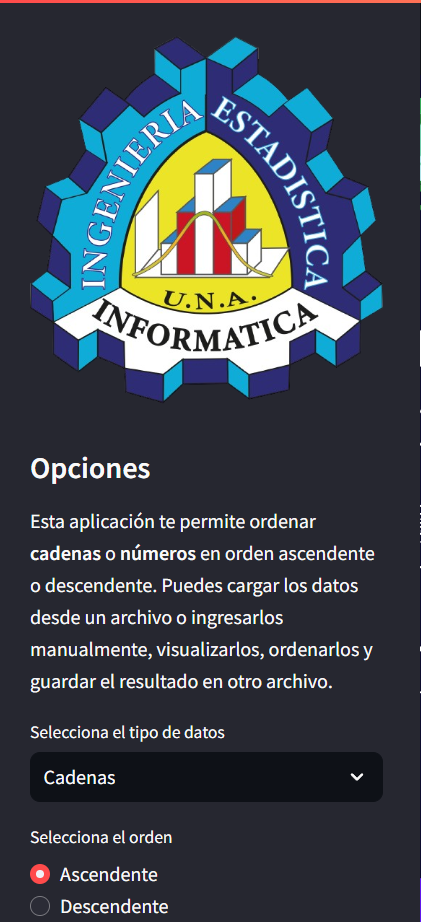
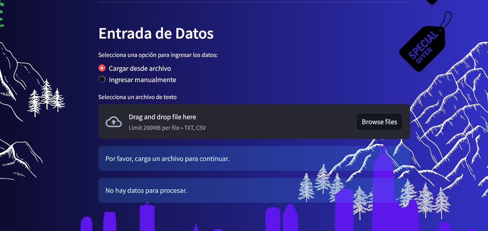
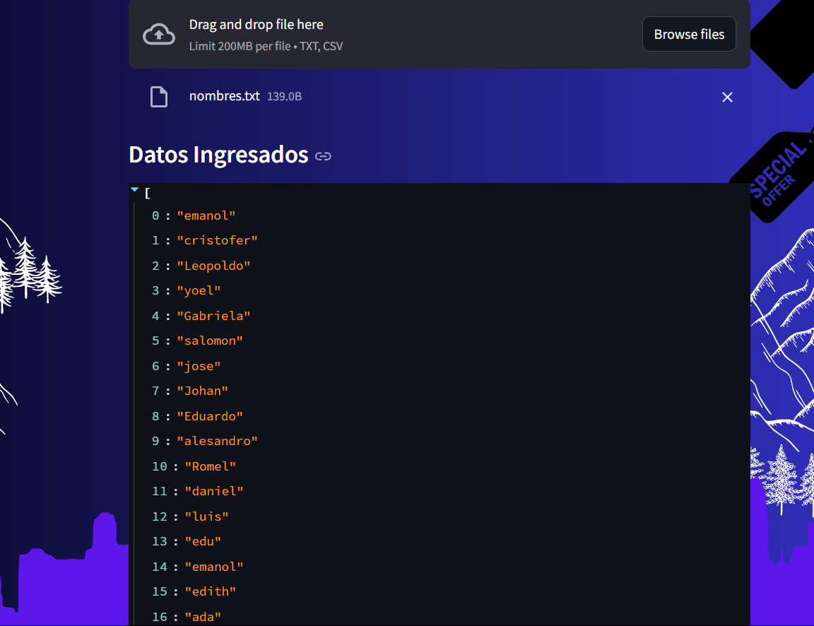
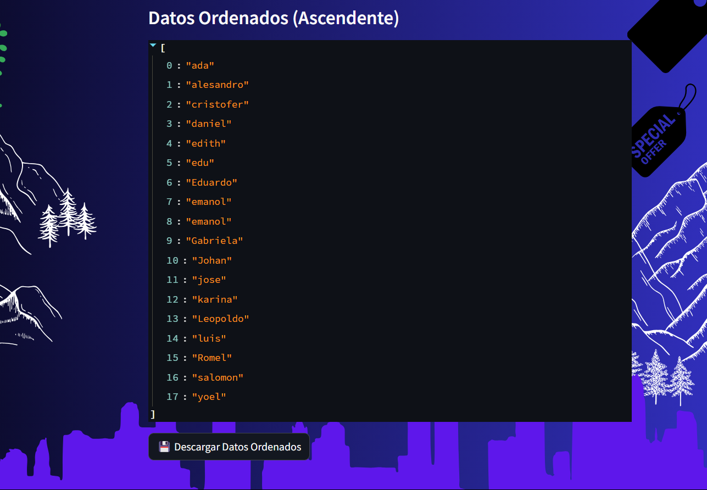

¡Claro, Cristian Daniel! A continuación te proporciono el contenido para el archivo `README.md` y te guío sobre cómo crear el archivo `LICENSE` para tu aplicación.

---

# 📋 Ordenador de Cadenas y Números

**Autor:** Cristian Daniel Ccopa Acero

**Universidad Nacional de Ingeniería**

**Facultad de Ingeniería Estadística e Informática**

**Curso:** Ingeniería de Software I

**Semestre:** Séptimo - 2024-II

---

## Descripción

Esta aplicación es una herramienta interactiva desarrollada con Streamlit que permite ordenar listas de cadenas o números utilizando el método de ordenamiento burbuja. Es especialmente útil para estudiantes y profesionales que necesitan organizar datos de forma rápida y sencilla.

## Características

- **Ordenamiento de Cadenas y Números:** Ordena datos en orden ascendente o descendente.
- **Método de Ordenamiento Burbuja:** Implementación del algoritmo burbuja para el ordenamiento.
- **Entrada de Datos Flexible:** Permite cargar datos desde un archivo o ingresarlos manualmente.
- **Visualización de Datos:** Muestra los datos originales y los datos ordenados para facilitar la comparación.
- **Descarga de Resultados:** Opción para descargar los datos ordenados en un archivo de texto.

## Capturas de Pantalla


*Figura 1: Página principal de la aplicación.*



*Figura 2: Barra Lateral y selección del tipo de datos y orden.*



*Figura 3: Opciones para cargar o ingresar datos manualmente.*



*Figura 4: Visualización de los datos ingresados.*



*Figura 5: Visualización de los datos ordenados y opción de descarga.*

## Cómo Usar la Aplicación

### Requisitos Previos

- **Python 3.7** o superior instalado.
- **Pip** para la gestión de paquetes de Python.

### Instalación

1. **Clonar el repositorio:**

   ```bash
   git clone https://github.com/tu_usuario/ordenador-datos.git
   cd ordenador-datos
   ```

2. **Crear un entorno virtual (opcional pero recomendado):**

   ```bash
   python -m venv venv
   source venv/bin/activate  # En Windows: venv\Scripts\activate
   ```

3. **Instalar las dependencias:**

   ```bash
   pip install -r requirements.txt
   ```

   El archivo `requirements.txt` debería contener:

   ```
   streamlit==1.25.0
   ```

### Ejecución de la Aplicación

Ejecuta la aplicación con el siguiente comando:

```bash
streamlit run app.py
```

Esto abrirá la aplicación en tu navegador predeterminado en la dirección `http://localhost:8501/`.

### Uso de la Aplicación

1. **Seleccionar Opciones:**

   - En la barra lateral, selecciona el **tipo de datos**: *Cadenas* o *Números*.
   - Selecciona el **orden**: *Ascendente* o *Descendente*.

2. **Ingresar Datos:**

   - **Cargar desde archivo:** Sube un archivo `.txt` o `.csv` con los datos.
   - **Ingresar manualmente:** Escribe o pega los datos en el área de texto, separados por comas o saltos de línea.

3. **Procesamiento de Datos:**

   - La aplicación mostrará los **Datos Ingresados** tal como los proporcionaste.
   - Al hacer clic en **Ordenar**, se mostrarán los **Datos Ordenados** utilizando el método burbuja.

4. **Descargar Resultados:**

   - Haz clic en **"💾 Descargar Datos Ordenados"** para guardar los datos ordenados en un archivo de texto.

## Estructura del Proyecto

```
ordenador-datos/
├── app.py
├── requirements.txt
├── README.md
├── LICENSE
└── images/
    ├── pagina_principal.png
    ├── seleccion_opciones.png
    ├── ingreso_datos.png
    └── datos_ordenados.png
```

- **app.py:** Código fuente de la aplicación Streamlit.
- **requirements.txt:** Lista de dependencias necesarias.
- **README.md:** Documentación de la aplicación.
- **LICENSE:** Información sobre la licencia del proyecto.
- **images/:** Carpeta que contiene las capturas de pantalla utilizadas en este README.

## Contribuciones

Si deseas contribuir a este proyecto, eres bienvenido. Por favor, sigue estos pasos:

1. Haz un *fork* del repositorio.
2. Crea una nueva rama con tu contribución: `git checkout -b feature/nueva-funcionalidad`.
3. Realiza tus cambios y haz *commit*: `git commit -m 'Agrega nueva funcionalidad'`.
4. Sube tus cambios a tu repositorio: `git push origin feature/nueva-funcionalidad`.
5. Crea un *pull request* en GitHub.
